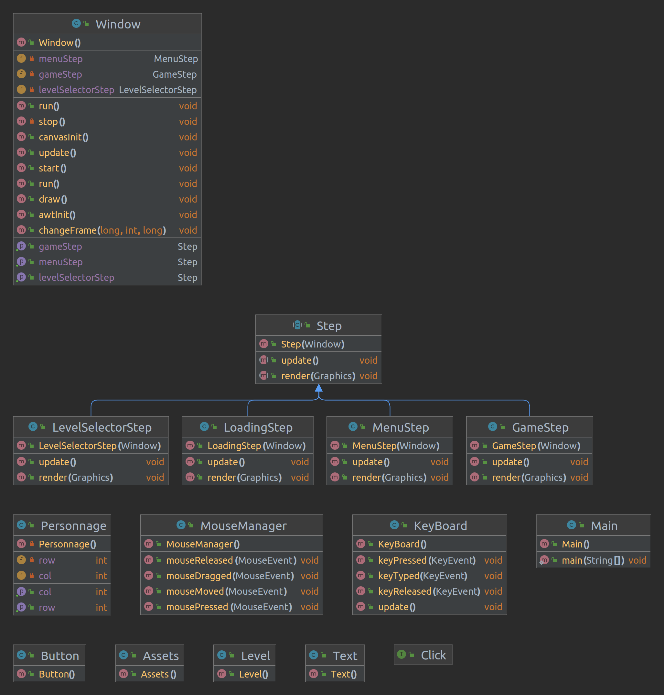
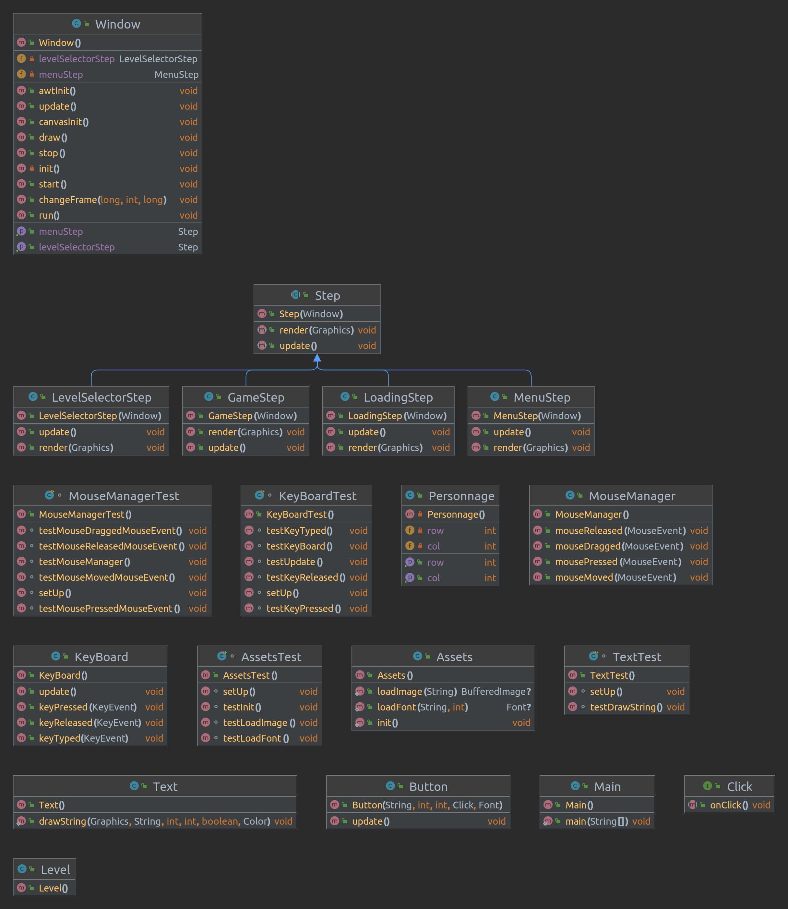
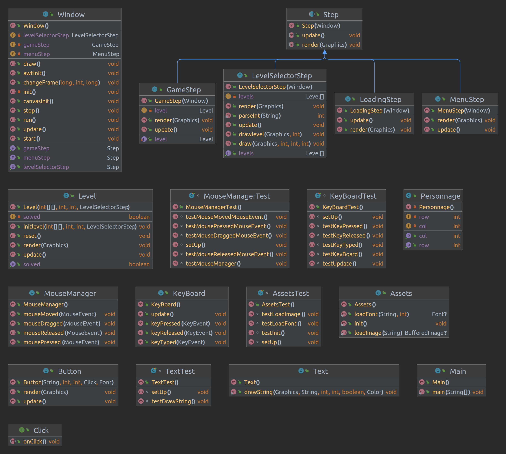
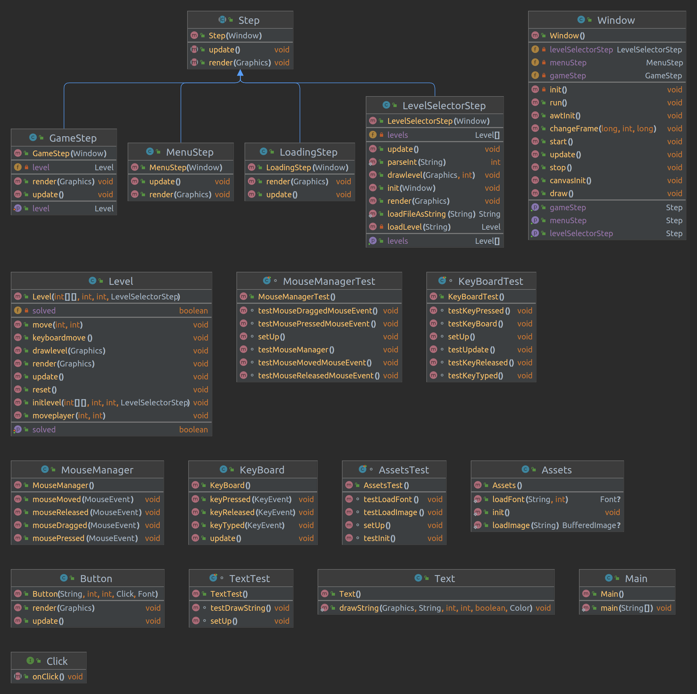
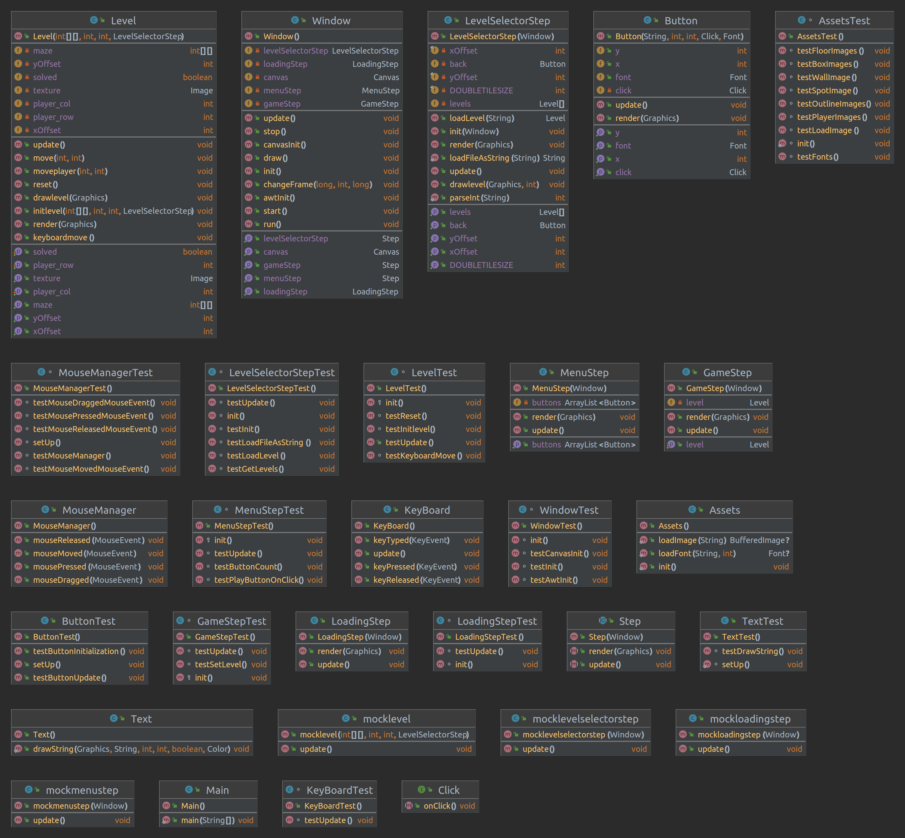

# Projet : Sokoban

## Membres du binôme :

* Yannick MOUNGUENGUI


## How To

## Récupérer le projet

```bash
git clone git@gitlab-etu.fil.univ-lille.fr:angeyannick.mounguenguiitoua.etu/projet-sokoban-mounguengui.git
```

*se placer dans le répertoire*

```bash
cd Projet-Sokoban-Mounguengui/Sokoban
```

# Avec le Makefile


**NB: vous pouvez faire la commande `make` directement pour générer la documentation et le jar en une seule fois**


## Génération et consultation de la documentation

*générer*

```bash
make doc
```

*consulter*

Ouvrir le fichier **index.html** situé dans le dossier **/doc** dans le navigateur.

## Compilation du code source

```bash
make cls
```

## Génération et exécution de l'archive

*construction du jar*

```bash
make sokoban.jar
```

*exécution du jar*

```bash
make sokoban
```

## Exécution des tests

```bash
make test
```

## Nettoyer les fichiers

```bash
make clean
```


# Sans Makefile

## Génération et consultation de la documentation

*générer*

```bash
javadoc -sourcepath src -d doc -subpackages main
```

*consulter*

Ouvrir le fichier **index.html** situé dans le dossier **/doc** dans le navigateur.


## Compilation du code source

```bash
javac -sourcepath src -d classes src/main/*.java
```

## Génération et exécution de l'archive

*construction du jar*

```bash
jar cvfm sokoban.jar META-INF/MANIFEST.MF -C classes main
```

*exécution du jar*

```bash
java -jar sokoban.jar
```

## Compilation et exécution des tests

*compiler*

```bash
javac -d classes -classpath ./lib/junit-platform-console-standalone-1.9.0.jar ./src/main/*.java  ./src/main/gfx/*.java ./src/main/input/*.java  ./src/main/menu/*.java ./src/main/ui/*.java ./src/main/levels/*.java  ./test/main/*.java ./test/main/ui/*.java ./test/main/mocks/*.java ./test/main/menu/*.java ./test/main/gfx/*.java ./test/main/levels/*.java ./test/main/input/*.java
java -jar ./lib/junit-platform-console-standalone-1.9.0.jar -cp classes --scan-classpath --disable-banner
```

*exécuter*

```bash
java -jar ./lib/junit-platform-console-standalone-1.9.0.jar -cp classes --scan-classpath --disable-banner
```

## Nettoyer les fichiers

```bash
rm -r doc classes sokoban.jar
```

# Versions  

## version 0

Durant cette semaine,ce fut la reflexion sur le choix du jeu à implementer et de la façon de le faire,c'est à dire avec ou sans graphismes avancés en cherchant des modèles pour avoir une idée de comment faire.

## version 1

Durant la semaine de la version 1,on a entamé la creation des packages nécessaires au developpement du jeu.La création la classe personnage qui fut finalement supprimé car elle n'était plus necessaire parceque la creation du personnage se fera dans la classe Assert du paquetage gfx.
Création de la classe Mousemanager pour le deplacement de la souris sur la fenetre graphique et creation de la classe window pour avoir une fenetre graphique et lancer les differents etapes du jeu.

    

## version 2

Durant cette semaine,il a été question de la creation de la classe assets pour le chargement d'images visuels dans le jeu.
D'une classe click pour permettre de clique sur les differents buttons du jeu,d'une classe button pour la creation des buttons utiles sur l'interface graphique tel que "play".
De la creation d'un Makefile pour lancer facilement les commandes de compilations,executions de tests,javadoc et jar pour le jeu.
Il a été question aussi de chercher les differentes ressources utiles à un meilleur affichage visuel du jeu.

    

## version 3

Cette semaine consacre la partie sur la creation d'une classe menustep pour le chargement du menu du jeu,d'une correction de la methode update de la classe button.
De la creation aussi des classes levelselectorstep pour un ecran qui permet de choisir les differents niveaux qu'on souhaite jouer,d'une classe loadingstep qui permet le chargement de chaque niveau du jeu,du debut de la classe level qui s'occupe des details de chaque niveau du jeu pour finir avec un premier affichage de la fenetre graphique meme si le jeu n'etant pas fonctionnel.

    

## version 4

Cette semaine se consacre à la continuité du developpement de la classe Level pour permettre de gerer les differents details de chaque niveau comme la methode qui decide de quand un niveau est resolue.
Creation de 10 niveaux pour le jeu et capacité à jouer le jeu avec commandes Makefile.

    

## version finale

Pour cette version,la javadoc des classes a été faite ainsi que la creation de tests pour les classes essentielles.

**NB: Tous les tests ne fonctionnent pas sur le terminal car la majorité des tests utilisent les ressources du jeu.Il est recommandé d'executer les tests sur Eclipse en ajoutant d'abord le dossier `res` au classpath du projet**

    
